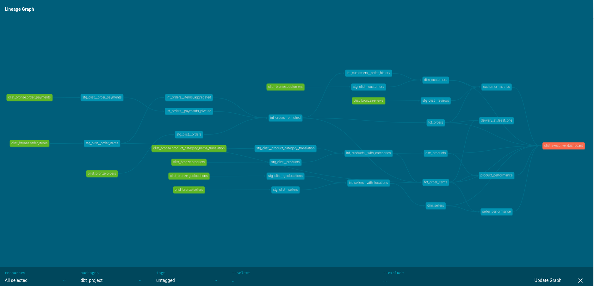

# Olist E-commerce ELT Pipeline
### *Orchestrated Data Warehouse with Airflow, dbt, and BigQuery*

[](https://airflow.apache.org/)
[](https://www.getdbt.com/)
[](https://cloud.google.com/bigquery)
[](https://docs.docker.com/compose/)

---

## Overview

A production-grade ELT pipeline for the [Olist Brazilian E-commerce dataset](https://www.kaggle.com/datasets/olistbr/brazilian-ecommerce), built as a portfolio project for **Analytics Engineer** roles.

The pipeline automates the full journey from raw CSV files in Google Cloud Storage to a dimensional Star Schema in BigQuery, orchestrated by Airflow and transformed by dbt — with 60+ automated data tests, incremental materializations, and a live Looker Studio dashboard.

---

## Architecture

```
┌────────────┐     ┌──────────────┐     ┌─────────────────────────┐     ┌──────────────┐
│  Raw CSVs  │────▶│  GCS Bucket  │────▶│  BigQuery (Bronze)      │────▶│ Looker Studio│
│  /raw_data │     │              │     │    ▼ Airflow ingestion  │     │  Dashboard   │
└────────────┘     └──────────────┘     │  Staging views (Silver) │     └──────────────┘
                                        │    ▼ dbt transforms     │
                                        │  Intermediate (ephem.)  │
                                        │    ▼                    │
                                        │  Facts & Dims (Gold)    │
                                        │  Analytics views (Gold) │
                                        └─────────────────────────┘
```

| Layer | Tool | Description |
|:---|:---|:---|
| **Orchestration** | Apache Airflow (LocalExecutor) | DAG-based scheduling and dependency management |
| **Ingestion** | Python / Airflow operators | Load raw Olist CSVs from GCS into BigQuery bronze tables |
| **Transformation** | dbt | SQL-based staging → intermediate → marts pipeline |
| **Warehouse** | Google BigQuery | Columnar storage with partitioning and clustering |
| **Visualization** | Looker Studio | Interactive BI dashboard *(update in progress)* |

---

## dbt Modeling

The transformation layer follows **dbt best practices** with a clear separation of concerns:

### Model Layers

| Layer | Materialization | Schema | Purpose |
|:---|:---|:---|:---|
| **Staging (`stg_`)** | `view` | `olist_silver` | Light cleaning, type casting, and renaming of raw sources |
| **Intermediate (`int_`)** | `ephemeral` | — | Business logic aggregations (not materialized in the warehouse) |
| **Marts — Core (`dim_` / `fct_`)** | `table` / `incremental` | `olist_gold` | Star Schema dimensions and facts |
| **Marts — Analytics** | `table` | `olist_gold` | Pre-aggregated analytical views (customer metrics, product & seller performance) |

### Key Design Decisions

- **Incremental models** — `fct_orders` and `fct_order_items` use `merge` strategy with composite unique keys to avoid full-table rebuilds
- **Ephemeral intermediates** — CTEs like `int_customers__order_history` and `int_orders__payments_pivoted` keep the warehouse clean while maintaining lineage
- **DRY macros** — Reusable logic in [`macros/`](dbt_project/macros/):
  - [`add_audit_columns()`](dbt_project/macros/data_quality.sql) — injects `_dbt_loaded_at` and `_dbt_run_id` into every model
  - [`clean_string()`](dbt_project/macros/data_quality.sql) — standardizes string columns
  - [`test_row_count_match()`](dbt_project/macros/data_quality.sql) — custom generic test for row count validation
- **Custom schema routing** — Models are routed to `olist_silver` or `olist_gold` via [`dbt_project.yml`](dbt_project/dbt_project.yml) config, with a custom `generate_schema_name` macro to avoid prefix concatenation

### Data Lineage



### Sources

All 9 Olist source tables are declared in [`_olist__sources.yml`](dbt_project/models/staging/olist/_olist__sources.yml) with descriptions and freshness configuration (commented out for this static dataset).

---

## Data Quality

A **tests-first** approach ensures every pipeline run is validated against **35+ data tests**:

| Category | Examples |
|:---|:---|
| **Primary key integrity** | `unique` + `not_null` on all surrogate keys |
| **Referential integrity** | Foreign key relationships between facts and dimensions (e.g., `fct_order_items.product_id` → `dim_products`) |
| **Business logic** | `price > 0`, `review_score` between 1–5, `cancellation_rate` between 0–1 |
| **Advanced expectations** | [`dbt_expectations`](dbt_project/packages.yml) tests (e.g., `expect_column_values_to_be_between`) |

Run all tests:
```bash
docker exec -it docker-dbt-1 bash -c \
  "cd /usr/app/dbt_project && dbt test --profiles-dir . --fail-fast"
```

### Packages

Defined in [`packages.yml`](dbt_project/packages.yml):
- `dbt_utils` — utility macros and generic tests
- `dbt_expectations` — Great Expectations-style schema tests
- `codegen` — model and source YAML generation

---

## Airflow DAGs

| DAG | File | Purpose |
|:---|:---|:---|
| **Bronze Ingestion** | [`bronze_ingestion_dag.py`](airflow/dags/bronze_ingestion_dag.py) | Load raw CSVs from GCS into BigQuery bronze tables |
| **Gold Transformation** | [`gold_transformation_dag.py`](airflow/dags/gold_transformation_dag.py) | `dbt run` (intermediate + marts) → verify gold tables → `dbt test` |
| **Data Quality** | [`data_quality_dag.py`](airflow/dags/data_quality_dag.py) | Standalone data quality checks across all layers |

---

## Project Structure

```
├── airflow/
│   ├── dags/                  # Airflow DAG definitions
│   │   ├── bronze_ingestion_dag.py
│   │   ├── gold_transformation_dag.py
│   │   ├── data_quality_dag.py
│   │   └── utils/             # Shared config (DRY constants)
│   ├── logs/
│   └── plugins/
├── dbt_project/
│   ├── models/
│   │   ├── staging/olist/     # stg_ views + source definitions
│   │   ├── intermediate/      # int_ ephemeral models
│   │   └── marts/
│   │       ├── core/          # dim_ and fct_ tables
│   │       └── analytics/     # Pre-aggregated analytical models
│   ├── macros/                # Reusable SQL (audit columns, cleaning, tests)
│   ├── tests/                 # Custom data tests
│   ├── dbt_project.yml        # Project configuration
│   ├── profiles.yml           # Connection profiles
│   └── packages.yml           # dbt package dependencies
├── docker/
│   ├── docker-compose.yml     # Multi-container orchestration
│   ├── Dockerfile.airflow     # Custom Airflow image
│   ├── Dockerfile.dbt         # Custom dbt image
│   ├── .env.example           # Environment variable template
│   └── keys/                  # GCP service account (gitignored)
├── raw_data/                  # Olist CSV files for GCS upload
└── assets/                    # Documentation images
```

---

## Quick Start

### Prerequisites
- **Docker Compose**
- A **GCP Service Account** (JSON key) with `BigQuery Admin` + `Storage Object Viewer` IAM roles

### Setup

1. **Clone the repo:**
   ```bash
   git clone https://github.com/a-nordstrom94/bigquery_warehouse.git
   cd bigquery_warehouse/docker
   ```

2. **Configure credentials:**
   - Place your GCP JSON key at `docker/keys/service_account.json`
   - Copy `.env.example` to `.env` and fill in your GCP project ID, bucket name, and location
   - Ensure `profiles.yml` exists in `dbt_project/` with matching connection details

3. **Upload raw data to GCS:**
   - Create a GCS bucket (matching `GCS_BUCKET` in `.env`)
   - Create a `raw-data/` folder in the bucket
   - Upload all CSV files from `raw_data/` into that folder

4. **Launch the pipeline:**
   ```bash
   docker compose up -d --build
   ```

5. **Access services:**

   | Service | URL | Credentials |
   |:---|:---|:---|
   | Airflow UI | [http://localhost:8080](http://localhost:8080) | `admin` / `admin` |
   | dbt Docs | [http://localhost:8081](http://localhost:8081) | N/A |

---

## Dashboard & Insights

The final output is an interactive **Looker Studio** dashboard connected to the Gold layer.

- **Key Metrics:** Total Revenue, Average Order Value, Customer Lifetime Value, Delivery Performance
- **Dashboard Link:** [View Live Dashboard](https://lookerstudio.google.com/u/0/reporting/333b49a4-5784-4e96-8056-d910960ab4d1/page/1AiiF)

> ⚠️ Dashboard is being updated to reflect the new dimensional model.

[](https://lookerstudio.google.com/u/0/reporting/333b49a4-5784-4e96-8056-d910960ab4d1/page/1AiiF)

---

## Tech Stack

| Technology | Role |
|:---|:---|
| **Apache Airflow 2.10.4** | Workflow orchestration |
| **dbt-core 1.8** | SQL transformation framework |
| **Google BigQuery** | Cloud data warehouse |
| **Google Cloud Storage** | Raw data lake |
| **Looker Studio** | Business intelligence |
| **Docker Compose** | Infrastructure as code |
| **PostgreSQL** | Airflow metadata database |

---

## Troubleshooting

### 🔑 Permissions (Linux / WSL2)

If you encounter `Permission Denied` errors when Airflow writes to `logs/`:

1. Run `id -u` on your host and set `AIRFLOW_UID` in `.env` to match
2. For development only: `chmod -R 775 ./airflow/logs`

> **Never** use `chmod 777` outside of local testing.

### 🛡️ AppArmor

On systems with **AppArmor** enabled, Docker volume mounts may be blocked. The `docker-compose.yml` uses the `:z` suffix on volume mounts for SELinux/AppArmor compatibility. If you still encounter issues:

```bash
# Check if AppArmor is blocking Docker
sudo aa-status

# Temporarily set the Docker profile to complain mode
sudo aa-complain /etc/apparmor.d/usr.sbin.docker
```

### ☁️ GCS / BigQuery

Ensure your service account has the correct IAM roles:
- `BigQuery Admin`
- `Storage Object Viewer`

---

## Lessons Learned

- **Stability over novelty** — Pinned Airflow to 2.10.4 after identifying provider instability in the 3.x ecosystem on Docker/Windows
- **DRY engineering** — Centralized shared config in [`utils/config.py`](airflow/dags/utils/config.py), reusable dbt macros, and environment-driven dataset routing
- **Incremental thinking** — Designed fact tables for incremental loads from day one to minimize BigQuery costs at scale
- **Testing as documentation** — 35+ data tests serve as both guardrails and living documentation of business rules
- **Container networking** — Resolved complex volume mapping between Windows/WSL2 hosts and Linux containers with AppArmor support
